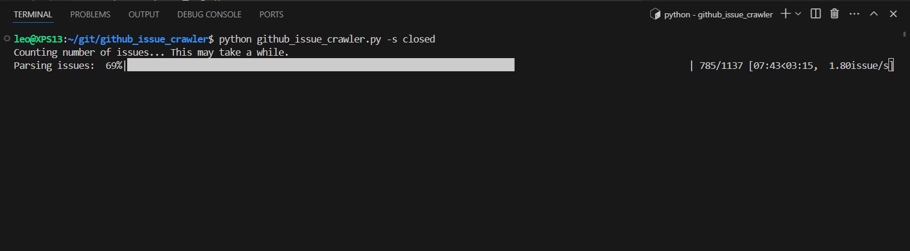

# GitHub Issue Crawler for ChatGPT Bots

This script fetches issues from a GitHub repository and saves them in Markdown format, with support for keyword and state filters. It was initially designed to aid in creating ChatGPT bots that can answer queries based on GitHub issues, aiding in model training.

An example of its application is the [Robo Advisor](https://chat.openai.com/g/g-njWAeq2iF-robo-advisor) bot, trained on ROS 2 repository issues. However, additional data sources may be required for comprehensive model training.

## Features

- Fetch issues from any GitHub repository.
- Filter issues by keywords.
- Select issues based on their state (open, closed, or all).
- Save all relevant issue information, including comments, into a single Markdown file.

## Prerequisites

Before you run this script, you need to have Python installed on your machine. Additionally, you will need a GitHub Personal Access Token with permissions to access repositories.

## Installation

1. Clone this repository:
   ```bash
   git clone https://github.com/leochien1110/github-issue-crawler.git
   cd github-issue-crawler
   ```
1. Install the required Python libraries:
    ```bash
    pip install -r requirements.txt
    ```

## Generate GitHub Personal Access Token
> :bulb: Without a GitHub access token, you will be limited to a lower rate limit for API requests.
Generate a personal access token from your GitHub account:

Go to **GitHub** -> **Settings** -> **Developer settings** -> **Personal access tokens** -> **Generate new token**.
Make sure to select the scopes or permissions you want to grant this token, such as repo for repository access. If you're unsure, select public repo.

Copy the generated token and use it in the configuration step. Save this token securely, as you won't be able to see it again.


## Usage
1. Setup your Github token in the environment variable:
```bash
export GITHUB_TOKEN=your_access_token
```
Or you can save this into `~/.bashrc` for future use:
```bash
echo "export GITHUB_TOKEN=your_access_token" >> ~/.bashrc
source ~/.bashrc
```

2. Run the script using the following command:
    ```bash
    python github_issue_crawler.py --repo [owner/repo] --state [open|closed|all] --keywords [keyword1 keyword2 ...] --output [output_file.md]
    ```
    The arguments are as follows:

    `-r, --repo`: The repository to fetch issues from, in the format `owner/repo`. For example, `ros2/rclpy`.

    `-s, --state`: The state of the issues to fetch (open, closed, or all). Default is 'closed'. It is not recommended to use `all` since it might reach the Github API request limit.

    `-k, --keywords`: **Optional** A list of keywords to filter the issues.

    `-o, --output`: **Optional** The output file where the issues will be saved in Markdown format. By default, the collected document will be saved under `notes/{owner}/{repo}_{keywords_}{timestamp}.md`. 

3. Take `ros2/rclpy` repository as an example:
    ```bash
    python github_issue_crawler.py -r ros2/rclpy -s closed -k bug
    ```

    Then you should see the output like this, the progress bar will show the fetching progress:
    

4. Then you can upload the generated markdown file to your ChatGPT bot for training. Enter the ChatGPT 

## Documentation Tool
There is another tool that helps you merge all the ROS documentation into a single file.

1. Download the [ROS documentation Repo](https://github.com/ros2/ros2_documentation).

2. Run the `merge_rst.py` to merge all the `.rst` files into a single file.
    ```bash
    python merge_rst.py <output_directory> <output_directory>
    ```
   

## Issues
```bash
github.GithubException.RateLimitExceededException: 403 {'message': 'API rate limit exceeded for user ID xxx...
```
This is because of the Github's [primary rate limit for authenticated users](https://docs.github.com/en/rest/using-the-rest-api/rate-limits-for-the-rest-api?apiVersion=2022-11-28#primary-rate-limit-for-authenticated-users). 

Long story for short,
* Personal token has a rate limit of 5,000 requests per hour.
* GitHub Enterprise Cloud organization have a higher rate limit of 15,000 requests per hour.

## Contributing
Contributions are what make the open source community such an amazing place to learn, inspire, and create. Any contributions you make are greatly appreciated.

1. Fork the Project
2. Create your Feature Branch (git checkout -b feature/AmazingFeature)
3. Commit your Changes (git commit -m 'Add some AmazingFeature')
4. Push to the Branch (git push origin feature/AmazingFeature)
5. Open a Pull Request

> :warning: Don't forget to hide the information in `config.json` before committing your changes.

## License
Distributed under the MIT License. See LICENSE for more information.

Contact
leochien1110@gmail.com

Project Link: https://github.com/leochien1110/github-issue-crawler

